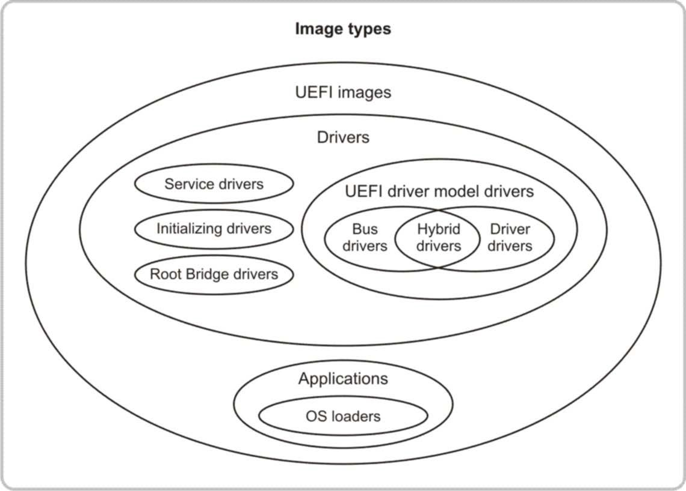

# UEFI Rootkit
Bachelor thesis about an UEFI Rookit communitcating witht the TPM module in an effort to gain trusted information from the windows boot process.

# Current Research

## "First UEFI rootikit found in the wild"
- https://www.welivesecurity.com/wp-content/uploads/2018/09/ESET-LoJax.pdf

## "Second ever UEFI rootkit found in the wild"
- https://www.bleepingcomputer.com/news/security/mosaicregressor-second-ever-uefi-rootkit-found-in-the-wild/
- https://securelist.com/mosaicregressor/98849/

# UEFI
- https://en.wikipedia.org/wiki/Unified_Extensible_Firmware_Interface
- https://uefi.org/sites/default/files/resources/UEFI_Spec_2_9_2021_03_18.pdf
- https://edk2-docs.gitbook.io/edk-ii-uefi-driver-writer-s-guide/3_foundation/31_basic_programming_model
## Images
- https://edk2-docs.gitbook.io/edk-ii-uefi-driver-writer-s-guide/3_foundation/readme.7
- PE/COFF header (Microsoft Portable Executable and Common Object File Format Specification)
- relocatable images
- supported platform types:
    - IA32-Intel IA-32 platforms
    - X64-Intel(R) 64 platforms
    - IPF-Intel(R) Itanium(R)-based platforms
    - EBC-EFI Byte Code platforms
- three different image types:
    - UEFI applications
    - UEFI boot services drivers
    - UEFI runtime drivers
- supported storage locations:
    - Expansion ROMs on a PCI card
    - System ROM or system flash
    - A media device such as a hard disk, floppy, CD-ROM, DVD, FLASH drive
    - LAN server
- image entry points receive own image handle
- pointer to UEFI system table

- [UEFI image types](https://edk2-docs.gitbook.io/edk-ii-uefi-driver-writer-s-guide/3_foundation/readme.7)
### Applications
- returns execution
- unloaded from memory afterwards
- not resident
- exception is os loader which does not return and instead calls `ExitBootServices()`
### Drivers
#### Boottime
- exist before `ExitBootServices()` is called
- `EfiBootServicesData` memory freed and reusable afterwards
#### Runtime
- stay after `ExitBootServices()` is called
- `EfiRuntimeServicesData` memory
- alternative calling mechanism during runtime
- handle database does not persist
## Platform initialization
https://edk2-docs.gitbook.io/edk-ii-uefi-driver-writer-s-guide/3_foundation/readme.15

# Library Comparison

## TianoCore EDK II
- https://github.com/tianocore/edk2
- https://en.wikipedia.org/wiki/TianoCore_EDK_II
- https://edk2-docs.gitbook.io/edk-ii-uefi-driver-writer-s-guide/
The first open source UEFI implementation, Tiano, was released by Intel in 2004. Tiano has since then been superseded by EDK[14] and EDK2[15] and is now maintained by the TianoCore community.[16]
- which uefi spec is supported?

## Project Mu
- https://github.com/microsoft/mu/
- https://microsoft.github.io/mu/faq/

## GNU-EFI
- https://wiki.osdev.org/GNU-EFI
- https://sourceforge.net/p/gnu-efi/code/ci/master/tree/

## POSIX-UEFI
- https://wiki.osdev.org/POSIX-UEFI
- https://gitlab.com/bztsrc/posix-uefi
- inspired by GNU-EFI
- a lot smaller

# Rootkit
- https://docs.microsoft.com/en-us/windows/security/information-protection/secure-the-windows-10-boot-process

# Implementation
- https://github.com/tianocore/tianocore.github.io/wiki/Getting-Started-with-EDK-II
- https://github.com/tianocore/tianocore.github.io/wiki/EDK-II-Platforms
- https://github.com/tianocore/tianocore.github.io/wiki/EDK-II-Documents
- https://github.com/tianocore/tianocore.github.io/wiki/UEFI-EDKII-Learning-Dev
- https://edk2-docs.gitbook.io/edk-ii-uefi-driver-writer-s-guide/
- https://edk2-docs.gitbook.io/edk-ii-uefi-driver-writer-s-guide/2_uefi_driver_implementation_checklist/22_how_to_implement_features_in_edk_ii
- https://stackoverflow.com/questions/63725239/build-edk2-in-linux
- https://github.com/tianocore/tianocore.github.io/wiki/Getting-Started-Writing-Simple-Application
# Testing
- https://github.com/tianocore/tianocore.github.io/wiki/Getting-Started-with-EDK-II
- https://github.com/tianocore/tianocore.github.io/wiki/Common-instructions
- https://github.com/tianocore/tianocore.github.io/wiki/How-to-build-OVMF
- https://stackoverflow.com/questions/63725239/build-edk2-in-linux
- `qemu-system-x86_64 --bios path/to/edk2/Build/OvmfX64/DEBUG_GCC5/FV/OVMF.fd -net none -hda fat:rw:hda-contents`

# Sources
- https://docs.microsoft.com/en-us/windows/security/information-protection/secure-the-windows-10-boot-process
- https://www.welivesecurity.com/wp-content/uploads/2018/09/ESET-LoJax.pdf
- https://www.bleepingcomputer.com/news/security/mosaicregressor-second-ever-uefi-rootkit-found-in-the-wild/
- https://securelist.com/mosaicregressor/98849/
- https://en.wikipedia.org/wiki/Unified_Extensible_Firmware_Interface
- https://github.com/tianocore/edk2
- https://en.wikipedia.org/wiki/TianoCore_EDK_II
- https://github.com/microsoft/mu/
- https://microsoft.github.io/mu/faq/
- https://uefi.org/sites/default/files/resources/UEFI_Spec_2_3_1.pdf
- https://uefi.org/sites/default/files/resources/UEFI_Spec_2_9_2021_03_18.pdf
- https://edk2-docs.gitbook.io/edk-ii-uefi-driver-writer-s-guide/
- https://www.youtube.com/watch?v=CGBpil0S5NI
- https://www.youtube.com/watch?v=P3yMXspLzoY
- https://wiki.osdev.org/UEFI
- https://wiki.osdev.org/GNU-EFI
- https://sourceforge.net/p/gnu-efi/code/ci/master/tree/
- https://wiki.osdev.org/POSIX-UEFI
- https://gitlab.com/bztsrc/posix-uefi
- https://doc.coreboot.org/
- https://github.com/tianocore/tianocore.github.io/wiki/Getting-Started-with-EDK-II
- https://github.com/tianocore/tianocore.github.io/wiki/EDK-II-Documents
- https://github.com/tianocore/tianocore.github.io/wiki/EDK-II-Platforms
- https://github.com/tianocore/tianocore.github.io/wiki/UDK

# Writer Guide Broken:
- https://edk2-docs.gitbook.io/edk-ii-uefi-driver-writer-s-guide/3_foundation/34_handle_database
- https://edk2-docs.gitbook.io/edk-ii-uefi-driver-writer-s-guide/3_foundation/readme.8